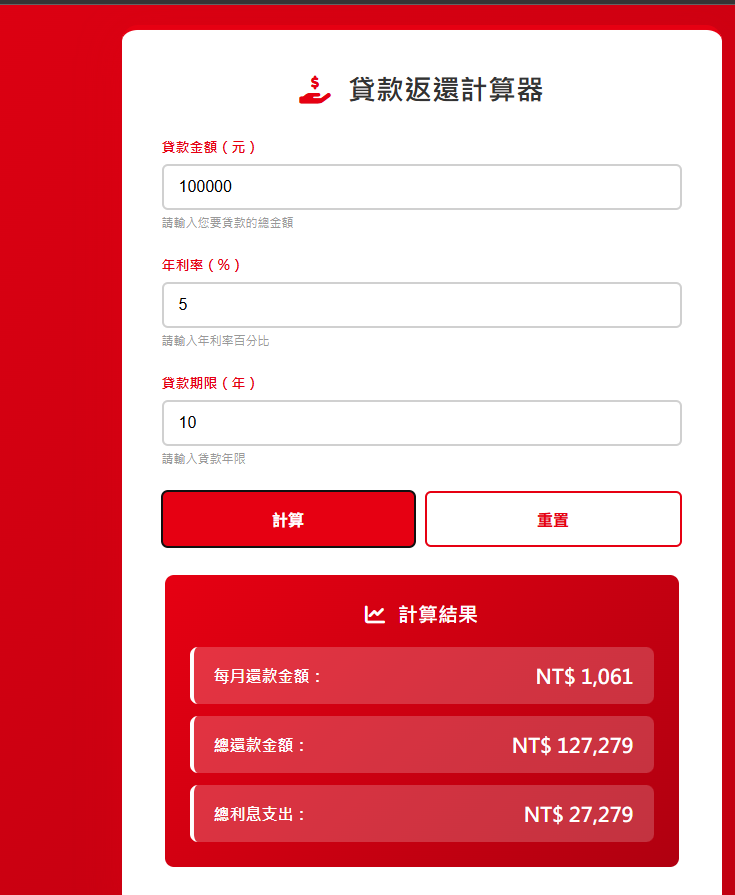
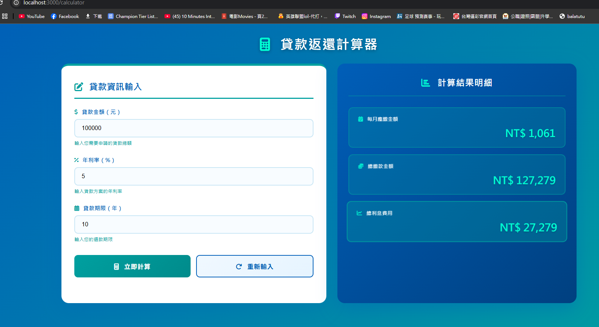
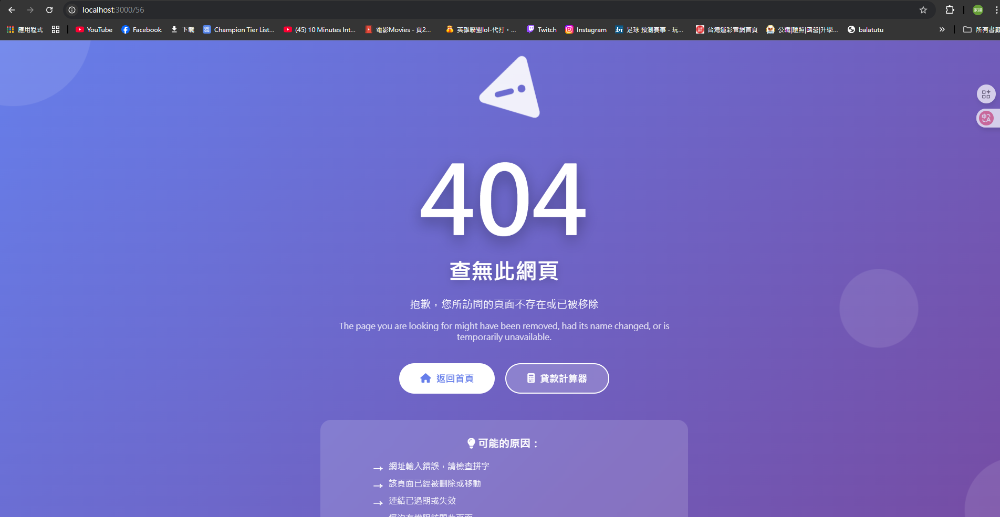
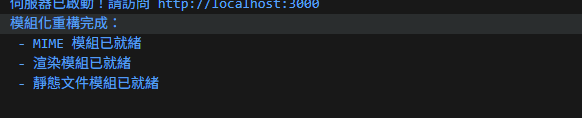

# 第2次隨堂題目-隨堂-QZ2
>
>學號：111111156    
><br />
>姓名：林家揚
>

本份文件包含以下主題：(至少需下面兩項，若是有多者可以自行新增)
- [x] 說明內容

## 說明程式與內容

開始寫說明，該說明需說明想法，
並於之後再對上述想法的每一部分將程式進一步進行展現，
若需引用程式區則使用下面方法，
若為.cs檔內程式除了於敘述中需註明檔案名稱外，
還需使用語法` ```語言種類 程式碼 ``` `，其中語言種類若是要用python則使用py，java則使用java，C/C++則使用cpp，
下段程式碼為語言種類選擇csharp使用後結果：

```csharp
public void mt_getResult(){
    ...
}
```

若要於內文中標示部分網頁檔，則使用以下標籤` ```html 程式碼 ``` `，
下段程式碼則為使用後結果：


1. a.

Ans: 
```js
// 第一部分：建立 MIME 類型模組

// 1. 將 2b.js 中的 contentTypes 物件抽取出來
const contentTypes = {
  '.html': 'text/html; charset=utf-8',
  '.ejs': 'text/html; charset=utf-8',
  '.js': 'text/javascript; charset=utf-8',
  '.css': 'text/css; charset=utf-8',
  '.json': 'application/json',
  '.png': 'image/png',
  '.jpg': 'image/jpg',
  '.gif': 'image/gif',
  '.svg': 'image/svg+xml',
  '.ico': 'image/x-icon'
};

/**
 * 2. 建立 getContentType(extname) 函數
 * 根據副檔名回傳對應的 MIME 類型
 */
export function getContentType(extname) {
  // 如果找不到副檔名，預設回傳 'text/plain'
  return contentTypes[extname] || 'text/plain';
}
 ``` 


1. b.
// 404 檔案也讀不到時，回傳 500
Ans:
```js
// utils/templateRenderer.js
import fs from 'fs';
import ejs from 'ejs';

/**
 * 建立 renderTemplate 函數
 * @param {object} res - HTTP 回應物件
 * @param {string} filePath - EJS 檔案路徑
 * @param {object} data - 傳遞給模板的資料（預設為空物件 {}）
 */
export function renderTemplate(res, filePath, data = {}) {
    // 讀取檔案
    fs.readFile(filePath, 'utf8', (err, template) => {
        // 包含錯誤處理：檔案讀取失敗時回傳 500 錯誤
        if (err) {
            console.error('模板讀取失敗:', err);
            res.writeHead(500, { 'Content-Type': 'text/html; charset=utf-8' });
            return res.end('500 - 伺服器內部錯誤：無法讀取模板');
        }

        try {
            // 使用 EJS 渲染
            const html = ejs.render(template, data);
            res.writeHead(200, { 'Content-Type': 'text/html; charset=utf-8' });
            res.end(html);
        } catch (renderErr) {
            console.error('EJS 渲染失敗:', renderErr);
            res.writeHead(500, { 'Content-Type': 'text/html; charset=utf-8' });
            res.end('500 - 伺服器內部錯誤：模板渲染失敗');
        }
    });
}

/**
 * 建立 render404 函數
 * 專門處理 404 錯誤頁面
 */
export function render404(res) {
    const filePath = './index3.ejs'; // 假設 404 使用 index3.ejs
    
    fs.readFile(filePath, 'utf8', (err, template) => {
        if (err) {
            // 404 檔案也讀不到時，回傳 500
            res.writeHead(500, { 'Content-Type': 'text/html; charset=utf-8' });
            return res.end('500 - 無法載入 404 頁面');
        }
        
        const html = ejs.render(template);
        res.writeHead(404, { 'Content-Type': 'text/html; charset=utf-8' });
        res.end(html);
    });
}
```


<!-- 請撰寫時，最後一句話再寫一次 -->


1. c.

Ans:
// utils/staticFileHandler.js
```js
// utils/staticFileHandler.js
import fs from 'fs';
import path from 'path';

// 引入先前建立的兩個模組
import { getContentType } from './mimeTypes.js';
import { render404 } from './templateRenderer.js';

/**
 * 建立 handleStaticFile(res, filePath) 函數
 * 負責讀取靜態文件（CSS、JS、圖片等）
 */
export function handleStaticFile(res, filePath) {
    // 取得副檔名
    const extname = path.extname(filePath);
    
    // 根據副檔名設定正確的 Content-Type
    const contentType = getContentType(extname);

    // 讀取靜態文件
    fs.readFile(filePath, (err, content) => {
        if (err) {
            // 若文件不存在，自動呼叫 render404()
            console.error(`無法讀取檔案: ${filePath}`);
            return render404(res);
        }

        // 回傳文件內容
        res.writeHead(200, { 'Content-Type': contentType });
        res.end(content);
    });
}
```

<!--  請撰寫時，第一句話再寫一次  -->

2. a.

Ans:
// 2b-refactored.js
```js
// 2b-refactored.js

// 1. 引入 Node.js 內建模組
import http from 'http';

// 2. 引入剛剛寫好的自定義模組
import { renderTemplate, render404 } from './utils/templateRenderer.js';
import { handleStaticFile } from './utils/staticFileHandler.js';

// ==========================================
// 創建伺服器並專注於路由邏輯
// ==========================================
http.createServer((req, res) => {
    // 獲取當前請求的 URL
    const url = req.url;

    // 3. 保留使用 switch 語句處理路由
    switch (url) {
        // 路由規則： / → 渲染 index.ejs
        case '/':
        case '/index':
            renderTemplate(res, './index.ejs', { title: '首頁' });
            break;

        // 路由規則： /calculator → 渲染 index2.ejs
        case '/calculator':
            renderTemplate(res, './index2.ejs', { title: '計算機', result: 0 });
            break;

        // 其他路徑 → 嘗試作為靜態文件處理
        default:
            // 呼叫靜態文件模組，傳入回應物件與檔案路徑
            // 注意：路徑前加上 '.' 代表從當前目錄找起
            handleStaticFile(res, '.' + url);
            break;
    }

}).listen(3000, () => {
    // 伺服器啟動後的提示訊息
    console.log('伺服器已啟動！請訪問 http://localhost:3000');
    console.log('模組化重構完成：');
    console.log(' - MIME 模組已就緒');
    console.log(' - 渲染模組已就緒');
    console.log(' - 靜態文件模組已就緒');
});
```


<!--  請撰寫時，第一句話再寫一次  -->

2. b.

Ans:

<!--  請撰寫時，第一句話再寫一次  -->

2. c.

Ans:

<!--  請撰寫時，第一句話和最後一句再寫一次  -->

2. d.

Ans:


